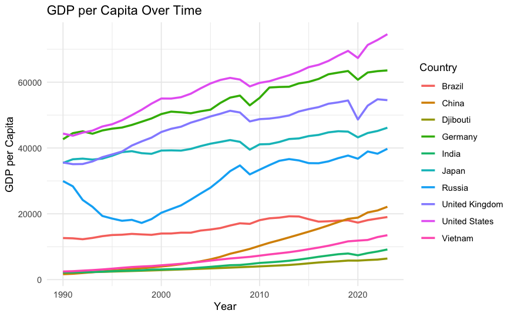
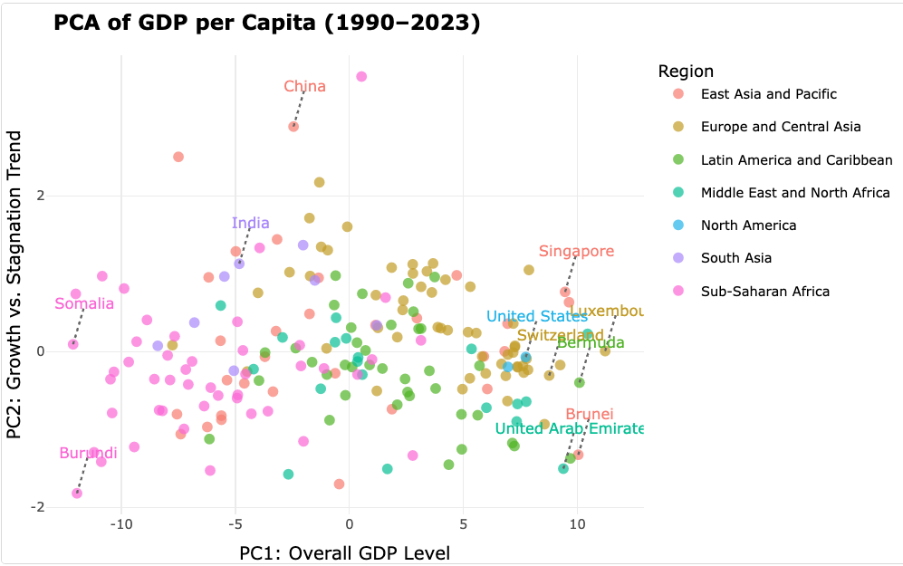
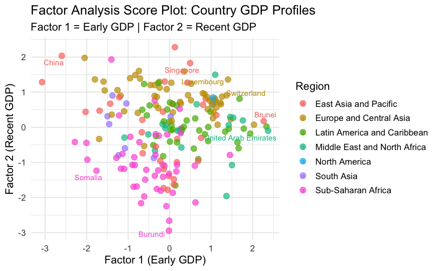
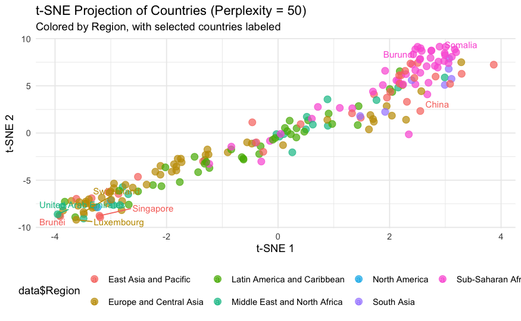

# Visualizing Global Economies: A Dimensionality Reduction Analysis of GDP Data

This project explores the complex landscape of global economic development by applying dimensionality reduction techniques to GDP per capita data for countries from 1990 to 2023. Through Principal Component Analysis (PCA), Factor Analysis (FA), and t-SNE, this analysis uncovers underlying patterns, identifies country clusters, and visualizes economic trajectories over three decades.



## Table of Contents
- [About the Project](#-about-the-project)
- [Techniques Used](#-techniques-used)
- [Key Findings](#-key-findings)
- [How to Run](#-how-to-run)
- [Conclusion](#-conclusion)
- [Acknowledgements](#-Acknowledgements)

---

## About the Project

The goal of this project was to distill high-dimensional economic data into interpretable, low-dimensional visualizations. By analyzing the GDP per capita time-series, we can move beyond simple country rankings to understand the structural similarities and differences in national economic journeys. The analysis investigates how different dimensionality reduction methods reveal distinct and complementary insights into global economic stratification and mobility.

---

## Techniques Used

Three primary dimensionality reduction techniques were employed to analyze the data:

1.  **Principal Component Analysis (PCA)**: Used to identify the main axes of variation in the data, effectively summarizing overall wealth and growth patterns.
2.  **Factor Analysis (FA)**: Applied with Varimax rotation to uncover latent (hidden) structures, revealing a more interpretable separation between historical and modern economic strength.
3.  **t-SNE (t-Distributed Stochastic Neighbor Embedding)**: Used to visualize the local similarities between countries, revealing tight clusters based on economic profiles that are not always apparent in linear methods like PCA.

---

## Key Findings

The analysis yielded several key insights into the structure of the global economy:

* **PC1 as Overall Wealth**: The first principal component (PC1) successfully captured over 97% of the variance and clearly represents a country's overall economic level across the entire time period.
* **PC2 as Growth Trajectory**: The second principal component (PC2) effectively distinguished between countries with different growth patterns—separating nations with recent, rapid growth from those with stagnant or declining economies.
* **Factor Analysis for Interpretability**: Rotated Factor Analysis provided a clearer story, with one factor representing "early-period strength" (1990s-2000s) and a second factor representing "recent-period strength" (2010s-present).
* **t-SNE for Clustering**: t-SNE produced distinct and well-separated clusters, often grouping countries by geographical region and income level (e.g., Sub-Saharan Africa, Western Europe), highlighting its strength in visualizing local similarities.

The PCA results effectively map these complex trends onto two dimensions, with the biplot below illustrating how countries are separated by overall economic level (PC1) and growth versus stagnation (PC2):



Factor Analysis provided a more interpretable view, with the rotated factors clearly separating historical economic strength (Factor 1) from more recent growth (Factor 2):



To reveal more granular, neighborhood-level similarities, the t-SNE projection provides a powerful alternative view, grouping countries into distinct clusters that strongly correspond to their geographical and economic regions:




---

## How to Run

1.  **Clone the repository:**
    ```sh
    git clone [https://github.com/your-username/gdp-visualization-pca.git](https://github.com/your-username/gdp-visualization-pca.git)
    ```
2.  **Open the R Markdown file** (`gdp-visualization-pca.Rmd`) in RStudio.

3.  **Install the required packages:**
    ```R
    install.packages(c("ggplot2", "dplyr", "Rtsne", "tidyr", "factoextra", "ggrepel", "psych"))
    ```
4.  **Run the code chunks** in the R Markdown file to reproduce the analysis and visualizations. **Note**: Remember to update the file path in the `read.csv()` function to a relative path if you include the data file in the repo.

---

## Conclusion

This project demonstrates that PCA, Factor Analysis, and t-SNE are powerful, complementary tools for exploring complex datasets. While PCA excels at capturing global variance, Factor Analysis provides more interpretable latent structures, and t-SNE is superior for visualizing local neighborhood structures and distinct clusters. Together, they offer a multifaceted view of global economic dynamics, turning a complex dataset into an insightful story.

---
##  Acknowledgements

This project was a collaborative effort. I would like to acknowledge my talented project partners:

* **Olivia Hartnett** 
* **Veda Sahithi Bandi**